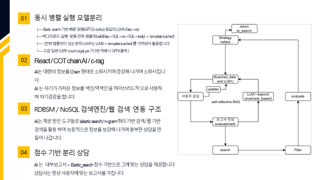
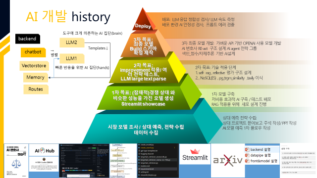
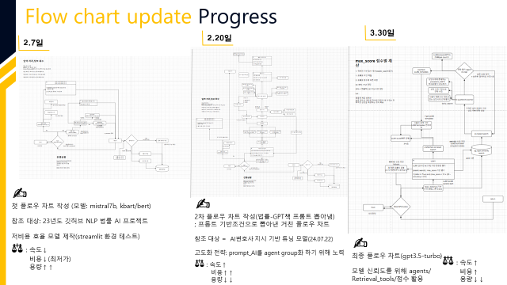
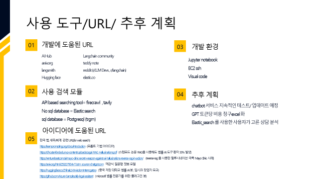

<a name="top"></a>


[](https://openai.com/)

# Lawmang 프로젝트

## 목차

- [설명](#-설명)
- [주요 서비스](#-주요-서비스)
- [시스템 구조](#-시스템-구조)
- [개발환경 설정](#-개발환경-설정)
- [구성 파일](#-구성-파일)
- [연락처](#-연락처)

## 🏛️ 설명

**Lawmang**은 AI를 활용해 다양한 법률 문제를 효율적으로 해결할 수 있도록 돕는 통합 법률 플랫폼입니다.  
사용자가 직면한 다양한 법률적 이슈에 대해 명확한 해답과 심층 분석 자료를 제공합니다.

주요 목표:

- 법률 지식이 없는 사용자도 쉽게 접근 가능한 인터페이스 제공
- 정확하고 신속한 법률 정보 제공
- 신뢰성 높은 외부 데이터 소스를 기반으로 서비스 구축

## 📄 주요 서비스

### 1️ 법률 상담 챗봇 (Legal Chatbot)

- 사용자의 질문을 분석하여 즉각적이고 정확한 법률상담 제공
- 법률 사례 및 판례 검색을 통한 상세한 법률 정보 제공
- Elasticsearch, PostgreSQL, FAISS 기반 검색 엔진 활용으로 높은 정확도 보장

### 2️⃣ 법률 용어 검색 서비스 (Legal Terms Search)

- 법률 전문 용어에 대한 정의와 설명 제공
- 빠르고 정확한 벡터 기반 검색을 통해 관련된 법률 용어를 쉽게 검색 가능

### 3️⃣ 딥 리서치 서비스 (Deep Research)

- 특정 법률 이슈에 대해 웹 기반의 심층 리서치 수행
- Firecrawl, Tavily API를 활용한 최신 법률 정보 및 자료 수집
- 수집된 자료를 바탕으로 요약 보고서 및 세부 리포트 생성

### 4️⃣ 사용자 개인화 서비스 (Personalization)

- 상담 기록 및 법률 상담 이력 관리
- 메모 작성 및 개인 기록 관리 기능 제공
- 사용자 맞춤형 콘텐츠 제공 (최근 조회한 상담, 개인 히스토리 등)

## 🗂️ 시스템 구조

```
app/
├── chatbot/              # 법률상담 및 챗봇 시스템
│   ├── initial_agents/   # 초기 사용자 질문 처리 및 유도 질문 생성
│   ├── tool_agents/      # 상담 전략 및 판례 관리
│   │   ├── qualifier.py
│   │   ├── planner.py
│   │   ├── precedent.py
│   │   └── executor/     # 상담 템플릿 및 최종 답변 관리
│   ├── vectorstore/      # FAISS 벡터 DB 관리
│   └── memory/           # 글로벌 캐시 및 메모리 관리
│
├── chatbot_term/         # 법률 용어 검색 시스템
│   └── vectorstore/      # 용어 검색 벡터 DB 관리
│
├── core/                 # 핵심 시스템 환경설정 및 DB 관리
│   ├── database.py       # 데이터베이스 연결 및 설정 관리
│   └── dependencies.py   # 의존성 주입 관리
│
├── deepresearch/         # 웹 기반 심층 리서치 서비스
│   ├── core/             # API 클라이언트 및 GPT 관리
│   ├── prompts/          # 리포트 생성 및 시스템 프롬프트 관리
│   ├── research/         # 키워드 생성 및 검색 처리 관리
│   └── reporting/        # 리포트 빌더 및 결과 보고서 생성
│
├── models/               # 데이터 모델 정의 (사용자, 히스토리 등)
├── routes/               # API 라우팅 관리
├── schemas/              # 데이터 스키마 관리 (Pydantic 모델)
└── services/             # 비즈니스 로직 및 서비스 로직 관리
    ├── consultation.py       # 법률 상담 서비스 관리
    ├── memo_service.py       # 사용자 메모 관리
    ├── history_service.py    # 사용자 히스토리 관리
    ├── precedent_service.py  # 판례 서비스 관리
    └── user_service.py       # 사용자 서비스 관리
```

### 데이터베이스 연결

- **PostgreSQL**: 법률 상담 기록 및 사용자 정보 관리
- **Elasticsearch**: 효율적이고 빠른 검색 지원 (법률상담 데이터)
- **FAISS**: 법률 용어 벡터 검색 지원

## 📄 구성 파일

| 기능                  | 설명                            | 주요 파일                                  |
| --------------------- | ------------------------------- | ------------------------------------------ |
| API 라우팅            | 전체 서비스 API 라우팅 관리     | `routes/*.py`                              |
| 데이터 관리           | 데이터 스키마 및 모델 정의 관리 | `models/*.py`, `schemas/*.py`              |
| 비즈니스 로직 관리    | 상담, 메모, 사용자 등 로직 관리 | `services/*.py`                            |
| 핵심 시스템 관리      | 데이터베이스 및 설정 관리       | `core/*.py`                                |
| 챗봇 시스템 관리      | 상담 챗봇 및 관련 로직 관리     | `chatbot/*.py`, `chatbot/tool_agents/*.py` |
| 법률 용어 검색 서비스 | 법률 용어 벡터 검색 관리        | `chatbot_term/*.py`                        |
| 딥 리서치 관리        | 심층 웹 리서치 관리             | `deepresearch/*.py`                        |

## 💻 개발환경설정

```shell
# Git 클론
- Lawmag > backend > 안 쪽에 가상환경 설정
conda create --prefix C:/conda_envs/lawmang_env python=3.11

- 가상환경 활성화
conda activate C:/conda_envs/lawmang_env

- 패키지 설치
pip install -r requirements.txt

# FastAPI 터미널에서 실행 (uvicorn 사용)
uvicorn app.main:app --reload

# 기본 api 확인
localhost:8000
```

## 📚개발 플로우



## 📚히스토리



# 플로우 차트 히스토리



# 사용도구/추후 계획



## 📃 자료

- [PPT자료]()
- [erd클라우드]()
- [(개인 보고서)시스템 목적 및 기술적 구현.docx]()

## 📞 연락처

프로젝트와 관련된 문의사항이나 협업 요청은 아래 연락처로 연락 부탁드립니다.

- **이메일**: [support@lawmang.com](mailto:support@lawmang.com)
- **웹사이트**: [https://lawmang.com](https://lawmang.com)
- **카카오톡**: Lawmang 카카오톡 플러스친구 (준비중)

[Back to top](#top)
